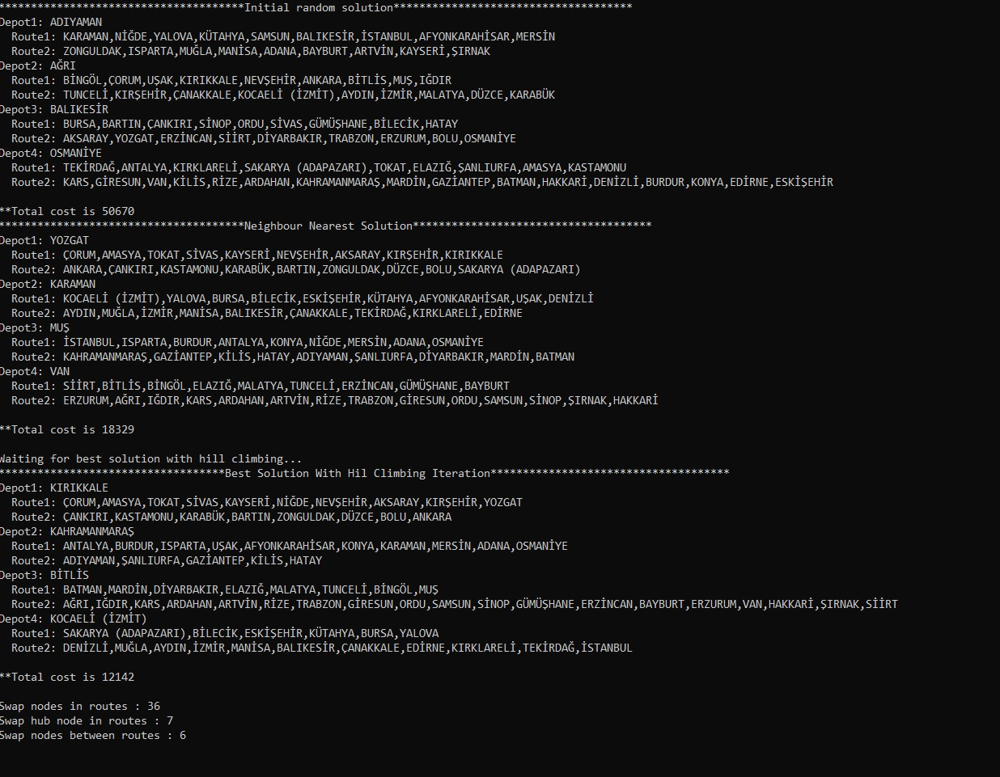

# mtsp-hill-climbing
<h3>
   
mvn clean package
     
java -jar target/mTSP.jar -d 5 -s 2 -v
     
-d is depots count
     
-s is salesman count
     
-v is show with city names or show with city no
     

  - -
  If you want to run hill climbing iteration just with inital random solution algorithm use :    
  java -jar target/mTSP.jar -d 2 -s 5 -n random -v
  --
  
</h3>
